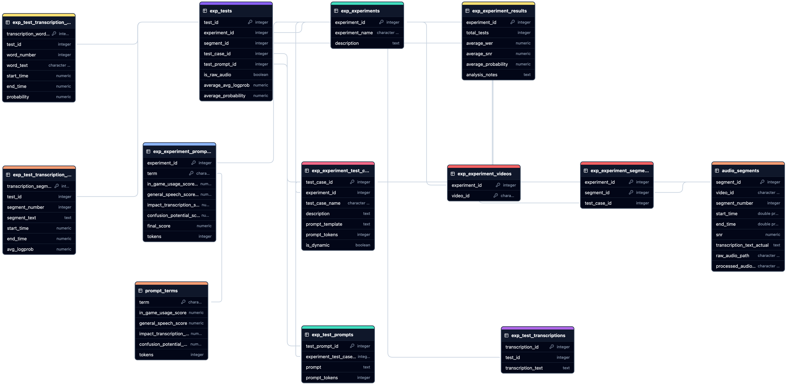

# Experiment Harness Database Schema Documentation

This document provides a comprehensive overview of the database schema used in the experiment harness. The schema is designed to store and manage data related to experiments, prompts, and audio segments.

---

## YouTube Audios to transcribe

This experiment harness is designed to fully integrate with the [`yt_dlp_async`](https://github.com/brettdavies/yt_dlp_async) repo. Detailed documentation can be found in the [docs](https://github.com/brettdavies/yt_dlp_async/tree/main/docs).

---

## Schema Diagram

To better understand the structure and relationships within the database, refer to the following schema diagram. An SVG version is available [here](images/ucsd_capstone_db_schema.svg).

<!-- https://app.chartdb.io/diagrams/4gnbhluwqxyz -->

---

## Table of Contents

- [1. Database Objects](#1-database-objects)
  - [1.1. Functions](#11-functions)
    - [1.1.1. Function: `update_modified_at_column`](#111-function-update_modified_at_column)
    - [1.1.3. Function: `propagate_soft_delete_experiments`](#113-function-propagate_soft_delete_experiments)
    - [1.1.4. Function: `propagate_soft_delete_test_prompts`](#114-function-propagate_soft_delete_test_prompts)
    - [1.1.5. Function: `propagate_soft_delete_tests`](#115-function-propagate_soft_delete_tests)
  - [1.2. Tables](#12-tables)
    - [1.2.1. `prompt_terms`](#121-prompt_terms)
    - [1.2.2. `audio_segments`](#122-audio_segments)
    - [1.2.3. Experimental Schema](#123-experimental-schema)
      - [1.2.3.1. `exp_experiments`](#1231-exp_experiments)
      - [1.2.3.2. `exp_experiment_results`](#1232-exp_experiment_results)
      - [1.2.3.3. `exp_experiment_videos`](#1233-exp_experiment_videos)
      - [1.2.3.4. `exp_experiment_test_cases`](#1234-exp_experiment_test_cases)
      - [1.2.3.5. `exp_experiment_segments`](#1235-exp_experiment_segments)
      - [1.2.3.7. `exp_test_prompts`](#1237-exp_test_prompts)
      - [1.2.3.8. `exp_tests`](#1238-exp_tests)
      - [1.2.3.9. `exp_test_prompt_terms`](#1239-exp_test_prompt_terms)
      - [1.2.3.10. `exp_test_transcriptions`](#12310-exp_test_transcriptions)
      - [1.2.3.11. `exp_test_transcription_segments`](#12311-exp_test_transcription_segments)
      - [1.2.3.12. `exp_test_transcription_words`](#12312-exp_test_transcription_words)

- [2. Soft Delete Mechanism](#2-soft-delete-mechanism)
  - [2.1. Functions and Triggers](#21-functions-and-triggers)
- [3. Indexes](#3-indexes)
- [Additional Notes](#additional-notes)

---

## 1. Database Objects

### 1.1. Functions

#### 1.1.1. Function: `update_modified_at_column`

**Purpose**: Updates the `modified_at` timestamp to the current time before a row is updated. This function ensures that the `modified_at` column accurately reflects the last modification time.

**Usage**: This function is called by triggers that execute before update operations on tables.

---

#### 1.1.3. Function: `propagate_soft_delete_experiments`

**Purpose**: Propagates soft deletes from the `exp_experiments` table to all related tables. When an experiment is soft-deleted, this function updates the `deleted_at` timestamp in all related experiment tables.

**Usage**: Triggered after update on the `exp_experiments` table when `deleted_at` is set.

---

#### 1.1.4. Function: `propagate_soft_delete_test_prompts`

**Purpose**: Propagates soft deletes from the `exp_test_prompts` table to related test tables. When a test prompt is soft-deleted, this function updates the `deleted_at` timestamp in associated test records.

**Usage**: Triggered after update on the `exp_test_prompts` table when `deleted_at` is set.

---

#### 1.1.5. Function: `propagate_soft_delete_tests`

**Purpose**: Propagates soft deletes from the `exp_tests` table to related transcription tables. When a test is soft-deleted, this function updates the `deleted_at` timestamp in associated transcription records.

**Usage**: Triggered after update on the `exp_tests` table when `deleted_at` is set.

---

### 1.2. Tables

#### 1.2.1. `prompt_terms`

**Purpose**: Stores terms or phrases used in prompts, along with scoring metrics related to their usage in games, general speech, transcription impact, and confusion potential.

**Columns**:

- `term` (VARCHAR, Primary Key): The term or phrase.
- `in_game_usage_score` (DECIMAL): Score indicating the term's usage in-game.
- `general_speech_score` (DECIMAL): Score indicating the term's usage in general speech.
- `impact_transcription_score` (DECIMAL): Score indicating the term's impact on transcription accuracy.
- `confusion_potential_score` (DECIMAL): Score indicating the potential for confusion with other terms.
- `tokens` (INTEGER): Number of tokens the term represents.
- `created_at` (TIMESTAMP WITH TIME ZONE): Timestamp when the term was added.
- `modified_at` (TIMESTAMP WITH TIME ZONE): Timestamp when the term was last modified.
- `deleted_at` (TIMESTAMP): Timestamp when the term was soft-deleted.

---

#### 1.2.2. `audio_segments`

**Purpose**: Stores segments of audio extracted from videos, along with associated metadata such as start and end times, signal-to-noise ratio (SNR), and actual transcription text.

**Columns**:

- `segment_id` (SERIAL, Primary Key): Unique identifier for the audio segment.
- `video_id` (VARCHAR): The video associated with the audio segment.
- `segment_number` (INTEGER): The sequence number of the segment within the video.
- `start_time` (FLOAT): Start time of the segment in the video.
- `end_time` (FLOAT): End time of the segment in the video.
- `snr` (DECIMAL): Signal-to-noise ratio of the segment.
- `transcription_text_actual` (TEXT): Actual transcription text of the segment.
- `raw_audio_path` (VARCHAR): File path to the raw audio segment.
- `processed_audio_path` (VARCHAR): File path to the processed audio segment.
- `created_at` (TIMESTAMP WITH TIME ZONE): Timestamp when the segment was created.
- `modified_at` (TIMESTAMP WITH TIME ZONE): Timestamp when the segment was last modified.
- `deleted_at` (TIMESTAMP): Timestamp when the segment was soft-deleted.

**Constraints**:

- Unique constraint on (`video_id`, `segment_number`) to prevent duplicate segments for a video.

---

#### 1.2.3. Experimental Schema

This schema contains tables related to experiments conducted, including test cases, results, and associated data.

##### 1.2.3.1. `exp_experiments`

**Purpose**: Stores information about experiments, including names and descriptions.

**Columns**:

- `experiment_id` (SERIAL, Primary Key): Unique identifier for the experiment.
- `experiment_name` (VARCHAR): Name of the experiment.
- `description` (TEXT): Description of the experiment.
- `created_at` (TIMESTAMP WITH TIME ZONE): Timestamp when the experiment was created.
- `modified_at` (TIMESTAMP WITH TIME ZONE): Timestamp when the experiment was last modified.
- `deleted_at` (TIMESTAMP): Timestamp when the experiment was soft-deleted.

---

##### 1.2.3.2. `exp_experiment_results`

**Purpose**: Stores aggregated results and analysis notes for experiments.

**Columns**:

- `experiment_id` (INTEGER, Primary Key, Foreign Key): References `exp_experiments`.
- `total_tests` (INTEGER): Total number of tests conducted in the experiment.
- `average_wer` (DECIMAL): Average Word Error Rate (WER) across tests.
- `average_snr` (DECIMAL): Average signal-to-noise ratio.
- `average_probability` (DECIMAL): Average probability score.
- `analysis_notes` (TEXT): Notes from the analysis.
- `created_at` (TIMESTAMP WITH TIME ZONE): Timestamp when the results were recorded.
- `modified_at` (TIMESTAMP WITH TIME ZONE): Timestamp when the results were last modified.
- `deleted_at` (TIMESTAMP): Timestamp when the results were soft-deleted.

---

##### 1.2.3.3. `exp_experiment_videos`

**Purpose**: Associates videos with experiments.

**Columns**:

- `experiment_id` (INTEGER, Foreign Key): References `exp_experiments`.
- `video_id` (VARCHAR): The video associated with the experiment.
- `created_at` (TIMESTAMP WITH TIME ZONE): Timestamp when the association was created.
- `modified_at` (TIMESTAMP WITH TIME ZONE): Timestamp when the association was last modified.
- `deleted_at` (TIMESTAMP): Timestamp when the association was soft-deleted.

**Constraints**:

- Primary Key on (`experiment_id`, `video_id`) to ensure unique associations.

---

##### 1.2.3.4. `exp_experiment_test_cases`

**Purpose**: Stores test cases for experiments, including prompt templates and whether they are dynamic.

**Columns**:

- `test_case_id` (SERIAL, Primary Key): Unique identifier for the test case.
- `experiment_id` (INTEGER, Foreign Key): References `exp_experiments`.
- `test_case_name` (VARCHAR): Name of the test case.
- `description` (TEXT): Description of the test case.
- `prompt_template` (TEXT): Template used for prompts.
- `prompt_tokens` (INTEGER): Number of tokens in the prompt.
- `is_dynamic` (BOOLEAN): Indicates if the test case uses dynamic prompts.
- `created_at` (TIMESTAMP WITH TIME ZONE): Timestamp when the test case was created.
- `modified_at` (TIMESTAMP WITH TIME ZONE): Timestamp when the test case was last modified.
- `deleted_at` (TIMESTAMP): Timestamp when the test case was soft-deleted.

---

##### 1.2.3.5. `exp_experiment_segments`

**Purpose**: Associates audio segments with experiments and test cases.

**Columns**:

- `experiment_id` (INTEGER, Foreign Key): References `exp_experiments`.
- `segment_id` (INTEGER, Foreign Key): References `audio_segments`.
- `test_case_id` (INTEGER, Foreign Key): References `exp_experiment_test_cases`.
- `created_at` (TIMESTAMP WITH TIME ZONE): Timestamp when the association was created.
- `modified_at` (TIMESTAMP WITH TIME ZONE): Timestamp when the association was last modified.
- `deleted_at` (TIMESTAMP): Timestamp when the association was soft-deleted.

**Constraints**:

- Primary Key on (`experiment_id`, `segment_id`) to ensure unique associations.

---

##### 1.2.3.6. `exp_experiment_prompt_terms`

**Purpose**: Stores terms used in prompts for experiments, along with weighted scores and final scores.

**Columns**:

- `experiment_id` (INTEGER, Foreign Key): References `exp_experiments`.
- `term` (VARCHAR, Foreign Key): References `prompt_terms`.
- `in_game_usage_score_weighted` (DECIMAL): Weighted in-game usage score.
- `general_speech_score_weighted` (DECIMAL): Weighted general speech score.
- `impact_transcription_score_weighted` (DECIMAL): Weighted transcription impact score.
- `confusion_potential_score_weighted` (DECIMAL): Weighted confusion potential score.
- `final_score` (DECIMAL): Final aggregated score.
- `tokens` (INTEGER): Number of tokens for the term.
- `created_at` (TIMESTAMP WITH TIME ZONE): Timestamp when the term was added to the experiment.
- `modified_at` (TIMESTAMP WITH TIME ZONE): Timestamp when the term was last modified.
- `deleted_at` (TIMESTAMP): Timestamp when the term was soft-deleted.

**Constraints**:

- Primary Key on (`experiment_id`, `term`) to ensure unique associations.

---

##### 1.2.3.7. `exp_test_prompts`

**Purpose**: Stores prompts used in tests, including prompt text and token count.

**Columns**:

- `test_prompt_id` (SERIAL, Primary Key): Unique identifier for the test prompt.
- `experiment_test_case_id` (INTEGER, Foreign Key): References `exp_experiment_test_cases`.
- `prompt` (TEXT): The prompt text.
- `prompt_tokens` (INTEGER): Number of tokens in the prompt.
- `created_at` (TIMESTAMP WITH TIME ZONE): Timestamp when the prompt was created.
- `modified_at` (TIMESTAMP WITH TIME ZONE): Timestamp when the prompt was last modified.
- `deleted_at` (TIMESTAMP): Timestamp when the prompt was soft-deleted.

**Constraints**:

- Unique constraints to prevent duplicate prompts, considering whether `prompt` is `NULL` or not.

---

##### 1.2.3.8. `exp_tests`

**Purpose**: Stores individual test executions, associating experiments, segments, test cases, and prompts.

**Columns**:

- `test_id` (SERIAL, Primary Key): Unique identifier for the test.
- `experiment_id` (INTEGER, Foreign Key): References `exp_experiments`.
- `segment_id` (INTEGER, Foreign Key): References `audio_segments`.
- `test_case_id` (INTEGER, Foreign Key): References `exp_experiment_test_cases`.
- `test_prompt_id` (INTEGER, Foreign Key): References `exp_test_prompts`.
- `is_raw_audio` (BOOLEAN): Indicates if raw audio was used.
- `average_avg_logprob` (NUMERIC): Average log probability.
- `average_probability` (NUMERIC): Average probability score.
- `created_at` (TIMESTAMP WITH TIME ZONE): Timestamp when the test was created.
- `modified_at` (TIMESTAMP WITH TIME ZONE): Timestamp when the test was last modified.
- `deleted_at` (TIMESTAMP): Timestamp when the test was soft-deleted.

**Constraints**:

- Unique constraint on (`experiment_id`, `segment_id`, `test_case_id`, `test_prompt_id`, `is_raw_audio`) to prevent duplicate tests.

---

##### 1.2.3.9. `exp_test_prompt_terms`

**Purpose**: Associates prompt terms with tests.

**Columns**:

- `experiment_id` (INTEGER, Foreign Key): References `exp_experiments`.
- `term` (VARCHAR): The prompt term.
- `test_id` (INTEGER, Foreign Key): References `exp_tests`.
- `created_at` (TIMESTAMP WITH TIME ZONE): Timestamp when the term was associated with the test.
- `modified_at` (TIMESTAMP WITH TIME ZONE): Timestamp when the record was last modified.
- `deleted_at` (TIMESTAMP): Timestamp when the record was soft-deleted.

**Constraints**:

- Primary Key on (`experiment_id`, `term`, `test_id`) to ensure unique associations.

---

##### 1.2.3.10. `exp_test_transcriptions`

**Purpose**: Stores transcriptions resulting from tests.

**Columns**:

- `transcription_id` (SERIAL, Primary Key): Unique identifier for the transcription.
- `test_id` (INTEGER, Foreign Key): References `exp_tests`.
- `transcription_text` (TEXT): The transcription text.
- `created_at` (TIMESTAMP WITH TIME ZONE): Timestamp when the transcription was created.
- `modified_at` (TIMESTAMP WITH TIME ZONE): Timestamp when the transcription was last modified.
- `deleted_at` (TIMESTAMP): Timestamp when the transcription was soft-deleted.

---

##### 1.2.3.11. `exp_test_transcription_segments`

**Purpose**: Stores segments of transcriptions from tests, including timing and probability data.

**Columns**:

- `transcription_segment_id` (SERIAL, Primary Key): Unique identifier for the transcription segment.
- `test_id` (INTEGER, Foreign Key): References `exp_tests`.
- `segment_number` (INTEGER): Sequence number of the segment.
- `segment_text` (TEXT): Text of the segment.
- `start_time` (NUMERIC): Start time of the segment.
- `end_time` (NUMERIC): End time of the segment.
- `avg_logprob` (NUMERIC): Average log probability of the segment.
- `created_at` (TIMESTAMP WITH TIME ZONE): Timestamp when the segment was created.
- `modified_at` (TIMESTAMP WITH TIME ZONE): Timestamp when the segment was last modified.
- `deleted_at` (TIMESTAMP): Timestamp when the segment was soft-deleted.

---

##### 1.2.3.12. `exp_test_transcription_words`

**Purpose**: Stores individual words from transcriptions, along with timing and probability data.

**Columns**:

- `transcription_word_id` (SERIAL, Primary Key): Unique identifier for the transcription word.
- `test_id` (INTEGER, Foreign Key): References `exp_tests`.
- `word_number` (INTEGER): Sequence number of the word.
- `word_text` (VARCHAR): The word text.
- `start_time` (NUMERIC): Start time of the word.
- `end_time` (NUMERIC): End time of the word.
- `probability` (NUMERIC): Probability score of the word.
- `created_at` (TIMESTAMP WITH TIME ZONE): Timestamp when the word was recorded.
- `modified_at` (TIMESTAMP WITH TIME ZONE): Timestamp when the word record was last modified.
- `deleted_at` (TIMESTAMP): Timestamp when the word record was soft-deleted.

---

## 2. Soft Delete Mechanism

The database uses a soft delete mechanism, where records are not physically removed but are marked as deleted by setting the `deleted_at` timestamp. This allows for data recovery and historical data analysis.

### 2.1. Functions and Triggers

- **Soft Delete Propagation Functions**: Functions like `propagate_soft_delete_experiments`, `propagate_soft_delete_test_prompts`, and `propagate_soft_delete_tests` are designed to propagate the soft delete action to related tables when a parent record is soft-deleted.
- **Triggers**: Triggers are set up on parent tables to automatically call the appropriate propagation function after an update that sets the `deleted_at` column.

---

## 3. Indexes

Indexes are created on various columns to improve query performance, especially on columns frequently used in `WHERE` clauses and joins.

**Examples**:

- Indexes on `experiment_id`, `segment_id`, and `test_case_id` in experimental tables to optimize experiment-related queries.
- Unique indexes to enforce constraints and ensure data integrity.
- Indexes on `term` in the `prompt_terms` table to speed up searches on terms.

---

## Additional Notes

- **Timestamp Columns**: All tables include `created_at`, `modified_at`, and `deleted_at` columns to track record creation, modification, and soft deletion times.

- **Foreign Key Constraints**: The schema enforces referential integrity through foreign key constraints, ensuring that related records exist in parent tables.

- **Data Integrity**: Unique constraints and indexes are used extensively to prevent duplicate records and maintain data consistency.

- **Extendability**: The schema is designed to be modular and extendable, allowing for future additions and modifications without significant restructuring.

---

## Conclusion

The `db_schema.sql` script establishes a robust and comprehensive database schema for managing experiments, prompts, and audio segments. It ensures data integrity through the use of constraints, triggers, and functions. The schema is designed with best practices such as soft delete mechanisms and automatic timestamp management to facilitate data recovery and auditing.

By incorporating thoughtfully designed indexes, the schema is optimized for performance, enhancing query efficiency and overall database responsiveness. The use of foreign key constraints and unique indexes maintains data consistency and enforces relationships between tables, supporting complex queries and data analysis tasks.

By following this documentation and the in-line comments, developers and database administrators can better understand the structure and functionality of the database, facilitating maintenance and future development.

For detailed implementation and usage, refer to the actual SQL scripts and application code.
